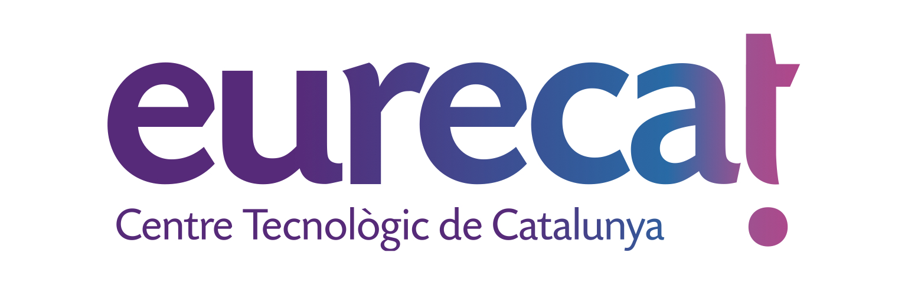

# Ontologies [Development]
## [PATHOCERT](https://w3id.org/def/pathocert-dd)
A SAREF4WATR extenstion to model incidence, emergency response and Risk Assessment modelling. The main intention of the ontology is to interlink water management information with water quality and risk assessment. This ontology has been elaborated under the PATHOCERT H2020 project.

## [NEXUS](https://seriousgame.sim4nexus.eu/ontology/)
The development of the SIM4NEXUS ontology is motivated by the need to integrate information from different data sources (systems, IoT, static information) referring water, energy, land use, climate change and their economics of different agencies and uses-cases around EU. The proposed ontology should be able to harmonise the high variability of terms referring to the same topic or domain (in ontology language called 'Thing'). The ontology will provide a common data understanding of this information based on the context (their use). Moreover, semantic enriched data represenation should be aligned with current standards from the integrated domains.
Considering these aspects, the SIM4NEXUS ontology main purpose is to provide a complete ontology (or semantic model) about all knowledge and decision-making processes around water, enery, land, climate and food production inclduding economics.
The scope of the SIM4NEXUS ontology is to represent the information from multiple systems that are observing an hetereogeneous number of water, land, energy and climate change variables. This variables will conform some policy evaluation scenarios. The type and the number of these variables will vary from one scenatio to others. So, one of the main aspects of the ontology is to make understandable the information collected from the scenarios and to harmonise it under a common model. For that, the ontology needs to follow standard definitions and terms adoptions from representative organizations (WMO, OGC, INSPIRE, W3C, etc).

## [GLOMICAVE](https://w3id.org/def/glomicave)
The proposed ontology not only focused on the abstract reference model but also, served as a extention to different metabolonic, gnomic and metabolites studies. Also, the ontoloy has been also linked with referent models in relation to provide observation and measurement ontology pattern. Finally, the proposed semantic model has been also linked with referent repositories for representing studies and assays: 1. Metabolites repository; 2. Metabolomic workbench; 3. GEO Repository
